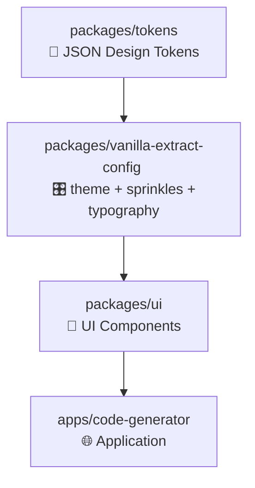

## 💡제품 개요

### 핵심 가치 제안

- **디자이너**: 디자인이 실제 화면에서 어떻게 구현되는지 실시간으로 확인
- **프론트엔드 개발자**: 드래그 앤 드롭으로 UI를 구성하고 즉시 React 코드(.tsx)를 생성하여 개발 생산성 향상

### 제품 목표

디자인 시스템 기반의 시각적 페이지 빌더를 통해 개발자와 디자이너 간의 협업을 개선하고 프론트엔드 개발 속도를 향상시킨다.

## 🙍🏻‍♀️ 타겟 사용자

### 1차 사용자: 프론트엔드 개발자

- **Pain Point**: 반복적인 UI 컴포넌트 작성으로 인한 개발 시간 소모
- **Goal**: 빠른 페이지 프로토타이핑 및 기본 구조 생성
- **Success Metric**: 페이지 개발 시간 50% 단축

### 2차 사용자: UI/UX 디자이너

- **Pain Point**: 디자인과 실제 구현 결과물 간의 차이
- **Goal**: 디자인 의도가 정확히 구현되는지 실시간 확인
- **Success Metric**: 디자인-개발 간 피드백 사이클 시간 단축

---

## ✅ MVP 핵심 기능

### Phase 1: 기본 디자인 시스템 (우선순위: 높음)

### 1.1 Atomic 컴포넌트

- **Form Elements**
  - Input (text, email, password)
  - Textarea
  - Select
  - Checkbox
  - Radio Button
- **Button**
  - Primary, Secondary, Tertiary 스타일
  - 다양한 사이즈 (sm, md, lg)
- **Display 컴포넌트**
  - Text/Typography
  - Image
  - Divider

### 1.2 Layout 컴포넌트

- **Container** (max-width, padding 설정)
- **Grid System** (12-column 기반)
- **Flexbox Container** (direction, justify, align 설정)

### 1.3 Table 컴포넌트

- 기본 테이블 구조
- 헤더/바디 구분
- 간단한 스타일링 옵션

### Phase 2: 비주얼 에디터 (우선순위: 높음)

### 2.1 드래그 앤 드롭 인터페이스

- **컴포넌트 팔레트**: 사용 가능한 컴포넌트 목록
- **페이지 프리뷰 영역**: 드래그 앤 드롭을 통해 실제 구성된 페이지를 preview 하는 영역
- **중첩 구조 지원**: Container 내부에 다른 컴포넌트 배치 가능
- **트리 뷰**: 현재 페이지의 컴포넌트 계층 구조 표시

### 2.2 실시간 프리뷰

- 드래그 앤 드롭으로 배치한 컴포넌트의 실시간 렌더링

### Phase 3: 속성 편집 시스템 (우선순위: 높음)

### 3.1 Props 에디터

- **선택된 컴포넌트의 속성 패널**
  - 텍스트 내용
  - 스타일 속성 (색상, 크기, 여백 등)
  - 레이아웃 속성
- **실시간 속성 변경**: 에디터에서 변경 시 즉시 프리뷰에 반영

### 3.2 스타일링 시스템

- **Design Foundation 통합**
  - Style Dictionary로 디자인 토큰 관리 (colors, typography, spacing 등)
  - Style Dictionary 빌드 시 Vanilla Extract용 타입/JS 모듈 자동 생성
- **기본 스타일 props**
  - margin, padding (foundation spacing scale 기반 → `sprinkles` 단일 속성 매핑)
  - width, height (foundating sizing 기반 → `sprinkles`)
  - background-color, color (foundation color palette, semantic color 기반 → `sprinkles`)
  - border, border-radius (foundation border tokens 기반 → `sprinkles`)
  - typography (복합 스타일로 `recipe` 제공)
- **토큰 기반 스타일링**: 모든 스타일 값이 디자인 토큰에서 파생

### Phase 4: 코드 생성 (우선순위: 높음)

### 4.1 TSX 파일 생성

- 구성된 페이지를 React 함수형 컴포넌트로 변환
- 적절한 import 문 자동 생성
- Props 인터페이스 정의 포함

### 4.2 코드 품질

- **Clean Code 원칙 적용**
  - 의미있는 컴포넌트명
  - 적절한 들여쓰기 및 포매팅
  - TypeScript 타입 안정성
- **스타일 코드 포함**
  - 인라인 스타일 또는 CSS 클래스
  - 반응형 스타일 고려

---

## ⚙️ 기술 스택

### Frontend

- **React 19+** with TypeScript
- **상태 관리**: Zustand
- **스타일링**:
  - **Style Dictionary**: 디자인 토큰 관리 및 변환
  - **Tailwind CSS**: 토큰 기반 유틸리티 클래스 (custom config 생성)
- **드래그 앤 드롭**: @dnd-kit
- **코드 프리뷰:** @monaco-editor/react
- **코드 생성**: 커스텀 AST 파서

### 개발 도구

- **Vite**: 빠른 개발 서버
- **Storybook**: 컴포넌트 문서화
- **ESLint + Prettier**: 코드 품질 관리
- **Turborepo**: 모노레포 환경 관리

---

## 프로젝트 구조

```text
.
├── apps/                          # 실제 서비스/애플리케이션
│   └── code-generator/            # Low-code Generator 프론트엔드 앱
│
├── docs/                          # 문서
│   └── design-tokens.md
│
├── packages/                      # 공통 라이브러리/패키지
│   ├── tokens/                    # 🎨 Design Tokens
│   │   ├── build/                 # style-dictionary 빌드 결과물
│   │   │   ├── css/               # CSS 변수
│   │   │   ├── js/                # JS 모듈
│   │   │   ├── json/              # JSON 포맷
│   │   │   ├── ts/                # TypeScript 타입 + 값
│   │   │   └── vanilla-extract/   # Vanilla Extract용 JS/TS
│   │   ├── scripts/               # 빌드/워치 스크립트
│   │   ├── src/                   # Foundation & Semantic Token JSON 정의
│   │   │   ├── foundation/        # Breakpoints, Colors, Font, Shadow, Shape, Sizing, Spacing, System
│   │   │   └── semantic/          # Colors, Elevation, Layout, Typography, Viewport
│   │   └── package.json
│   │
│   ├── vanilla-extract-config/    # 🎛 Design System Runtime (theme/sprinkles/typography)
│   │   ├── src/
│   │   │   ├── theme.css.ts       # ThemeContract + GlobalTheme 정의
│   │   │   ├── sprinkles.css.ts   # Sprinkles 아토믹 스타일 유틸
│   │   │   ├── typography.css.ts  # Typography recipe (복합 스타일)
│   │   │   └── index.ts           # vars, sprinkles, typography export
│   │   └── package.json
│   │
│   └── ui/                        # 🧩 UI 컴포넌트
│       ├── src/
│       │   ├── components/        # Button, Input 등 UI 컴포넌트
│       │   └── index.ts
│       └── package.json
│
├── repo/                          # 공통 설정
│   ├── eslint-config/             # eslint 공유 설정
│   └── typescript-config/         # tsconfig 공유 설정
│
├── turbo.json                     # Turborepo 파이프라인 정의
├── pnpm-workspace.yaml            # pnpm workspace 정의
└── package.json                   # root config

```

### 디자인 토큰 워크플로우

- Design Foundation → Style Dictionary → Vanilla Extract (theme, sprinkles, recipe for typography) → React Components (recipe for component tokens)
- Build pipeline: 토큰 변경 시 자동 빌드 및 배포



---

## 🏁 나만의 성공 지표

Low-code generator 프로젝트를 진행하면서 얻을 수 있는 경험을 토대로 개인적인 성공 지표를 생성했습니다.

### 기술적 성장

- **드래그 앤 드롭 & 트리 구조 관리**: @dnd-kit, JSON 기반 노드 트리 설계 및 실시간 Preview 동기화 경험
- **코드 생성 엔진**: JSON → TSX 변환, TypeScript 인터페이스 자동화, 포매터 적용 경험
- **Monorepo 관리**: Turborepo 기반으로 패키지 분리와 빌드 파이프라인 최적화 경험

### 제품 개발 프로세스 경험

- MVP 설계 → 로드맵 기반 스프린트 진행 → 테스트 & 배포까지 **일련의 제품 개발 사이클 경험**
- **PoC 진행**을 통한 아이디어 검증 및 리스트 관리 경험
- 디자인 토큰 시스템 정의 및 디자인 시스템 개발을 통한 **디자인 시스템 개발 및 활용 문화 체험**
- **Storybook** 도입 → **문서화 문화 체험**

## 🏁 성공 지표 (KPI)

### 사용성 지표

- **페이지 생성 시간**: 평균 10분 이내로 기본 페이지 완성
- **코드 품질**: 생성된 코드가 ESLint 통과율 95% 이상
- **사용자 만족도**: NPS 8점 이상

### 기술적 지표

- **성능**: 50개 컴포넌트까지 지연 없는 드래그 앤 드롭
- **호환성**: 생성된 코드가 React 19+ 환경에서 정상 작동

---

## 🗓️ 개발 로드맵

### Week 1: 디자인 토큰 시스템 구축

- tokens 폴더 구조 설계 (colors, typography, spacing, borders 등)
- tokens 패키지 하위에 foundation/semantic JSON 정의
- Style Dictionary 기본 설정
  - CSS 변수, JSON, TS 모듈 동시 빌드
  - Vanilla Extract에서 import 가능한 타입/값 구조 생성
- Vanilla Extract 연동
  - `theme.css.ts`: 토큰 반영
  - `sprinkles.css.ts`: spacing, sizing, color, layout 속성 정의
  - `typography.css.ts`: typography recipe 정의

### Week 2: 컴포넌트 시스템 개발

- 기본 Atomic 컴포넌트 개발
- `recipe` 기반 컴포넌트 토큰 정의 및 개발
- Storybook 환경 설정

### Week 3: 컴포넌트 시스템 완성

- Layout, Form, Table 컴포넌트 개발
- Storybook 내 Token Docs 패널 구성
- Storybook 문서화 + 토큰 기반 옵션 (semantic colors, spacing scale) 적용

### Week 4: 컴포넌트 팔레트 구성

- 컴포넌트 메타데이터(JSON) 스키마 설계
- 팔레트 UI 구성: 컴포넌트 리스트 출력
- 팔레트 → 메타데이터(JSON) 연결

### Week 5: 페이지 프리뷰 개발

- @dnd-kit 적용 → Drag & Drop 가능한 Preview Dropzone 구현
- 노드 트리 타입 정의 → 배치된 컴포넌트를 노드 트리(JSON)로 관리
- 트리 구조 기반으로 Drop된 요소들 렌더링

### Week 6: 트리 뷰 개발

- 현재 노드 트리(JSON) → Tree UI 렌더링
- Tree UI와 Preview 양방향 동기화

### Week 7: 속성 편집 시스템 (기본)

- 선택된 컴포넌트의 props 패널 노출
- Props 에디터에 노출할 토큰 기반 옵션 설계 및 구성

### Week 8: 속성 편집 시스템 (토큰 통합)

- Props 편집 에디터에 토큰 기반 옵션 추가
- Preview 즉시 반영 확인

### Week 9: 코드 생성 엔진 개발

- 노드 트리(JSON) 구조 → React TSX 변환 로직 구현
- import 문 자동 생성
- 기본적인 props → JSX 변환
- 단순 페이지 단위 컴포넌트 TSX 생성

### Week 10: 코드 생성 엔진 완성

- Typescript 타입 인터페이스 자동 정의
- Clean Code 원칙 반영
- ESLint/Prettier 포매팅 통과 확인

### Week 11: 코드 프리뷰 & 다운로드 개발

- Monaco Editor 기반 코드 프리뷰 패널 구현
- “Download TSX” 기능 추가

### Week 12: 통합 테스트

- 사용자 시나리오 테스트
  - Palette → DnD → Tree UI & Preview → Props 편집 → 코드 생성 → 다운로드
- 토큰 일관성 검증
- 성능 테스트
- 버그 수정

### Week 13: 폴리싱 & 베타 버전 배포

- UX 개선 (온보딩 튜토리얼, 기본 템플릿 등 제공)
- 베타 버전 배포

---

## ✔️ 제외 사항 (향후 버전에서 고려)

- **상태 관리 코드 생성** (useState, useEffect 등)
- **API 연동 코드**
- **반응형 디자인 시스템**
- **복잡한 애니메이션**
- **다중 페이지 관리**
- **버전 관리 시스템**
- **협업 기능** (실시간 동시 편집)
- **다크 모드 토큰 지원** (현재는 라이트 모드만)

---

## ✏️ 리스크 및 대응 방안

### 기술적 리스크

- **복잡한 중첩 구조**: 트리 구조 관리의 복잡성
  - **대응**: 단계적으로 중첩 depth 제한 (최대 5단계)
- **코드 생성 품질**: 가독성 있는 코드 생성의 어려움
  - **대응**: 템플릿 기반 생성 + 코드 포매터 활용

### 제품적 리스크

- **학습 곡선**: 사용자의 도구 적응 시간
  - **대응**: 단계별 온보딩 튜토리얼 제공

---

## 성공 정의

MVP가 성공했다고 판단하는 기준:

1. **10명의 베타 사용자**가 각각 5개 이상의 페이지를 성공적으로 생성
2. **생성된 코드의 90% 이상**이 수정 없이 실제 프로젝트에 적용 가능
3. **사용자 피드백 점수** 7점 이상 (10점 만점)
4. **기술적 안정성**: 크리티컬 버그 0건

---
