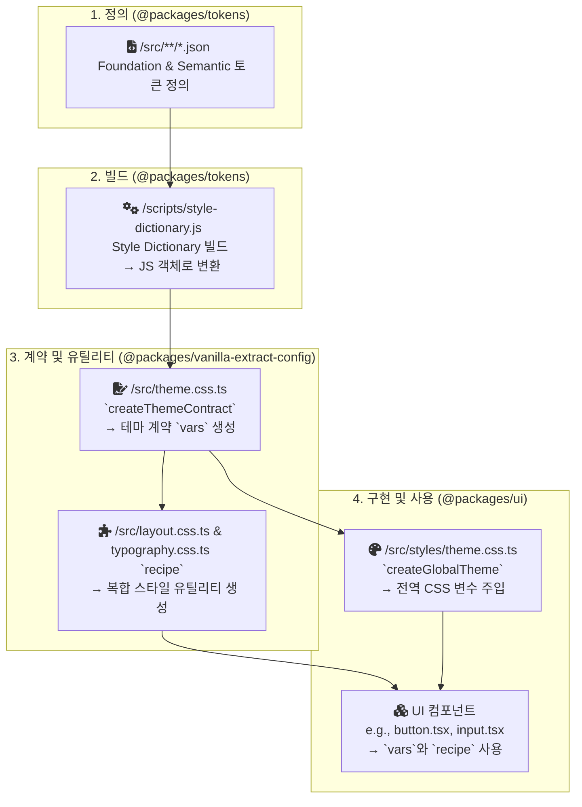

# 디자인 토큰 시스템 (Design Token System)

## 1. 소개 (Introduction)

본 문서는 프로젝트의 일관된 UI·UX를 보장하기 위한 디자인 토큰 시스템을 기술합니다. 디자인 토큰은 **색상(Color)**, **타이포그래피(Typography)**, **간격(Spacing)** 등 UI를 구성하는 가장 작은 단위의 시각적 요소를 변수화한 것입니다.

이 시스템은 **Foundation 토큰**과 **Semantic 토큰**의 2-Tier 구조를 가집니다.

- **Foundation Tokens**:

  - 색상 팔레트, 글꼴 크기 등 구체적인 값을 가지는 원시(primitive) 토큰입니다. 디자인 시스템의 가장 기초적인 시각 요소를 정의합니다.

- **Semantic Tokens**:
  - 디자인의 맥락(Context)에 따라 의미를 부여한 토큰입니다.
  - Foundation 토큰을 참조하여 의미적 일관성을 유지합니다.

## 2. 토큰 네이밍 컨벤션 (Token Naming Convention)

### 2.1 Foundation 토큰 네이밍 구조

Foundation 토큰의 네이밍은 일반적으로 다음 패턴을 따릅니다.

```cpp
{category}-{property}-{scale?}
```

| 구분         | 의미               | 예시                                        | 비고        |
| ------------ | ------------------ | ------------------------------------------- | ----------- |
| **Category** | 토큰의 최상위 분류 | `color`, `font`, `sizing`                   | 항상 소문자 |
| **Property** | 세부 속성          | `brand`, `neutral`, `weight`, `line-height` |             |
| **Scale**    | 숫자, 단계         | `100`, `200`, `bold`, `semibold`            |             |

#### 2.1.1 단위 규칙 (Value Unit System)

모든 단위 값은 일관성을 유지하기 위해 기본 단위 스케일(4px base grid)에 따라 정의됩니다.
| 카테고리 | 기준 단위 | 예시 |
| ------------- | -------- | ----------------------------------------------- |
| **Sizing** | 1 = 4px | `sizing.4 = 16px` |
| **Shadow** | Token 레벨 | `shadow.elevation2 = 0 4px 8px rgba(0,0,0,0.1)` |

**예시:**

- `color-brand-100`: 기본 텍스트의 색상
- `font-size-md`: 중간 사이즈의 글꼴 크기
- `sizing-1`: 4px 단위 시스템의 간격 (4px)
- `sizing-2`: 4px 단위 시스템의 간격 (4px \* 2 = 8px)

### 2.2 Semantic 네이밍 컨벤션

Semantic 토큰은 Foundation 값을 참조하여 의미 있는 목적으로 재구성된 계층입니다. 일반적으로 다음과 같은 패턴을 따릅니다.

```cpp
{category}-{type}-{variant}-{state?}
```

| 구분         | 설명                              | 예시                                         | 비고   |
| ------------ | --------------------------------- | -------------------------------------------- | ------ |
| **Category** | 의미 그룹                         | `color`, `layout`, `typography`, `elevation` |        |
| **Type**     | UI 맥락 기반의 특정 기능이나 역할 | `text`, `background`, `heading`, `container` |        |
| **Variant**  | 단계나 변형                       | `success`, `info`, `lg`, `xl`, `raised`      |        |
| **State**    | 상호작용 상태                     | `hovered`, `disabled`, `focused`, `selected` | 선택적 |

#### 2.2.1 Semantic 토큰의 Foundation 토큰 참조 구조

```json
// semantic/colors.json
{
  "color": {
    "text": {
      "base": {
        "default": { "value": "{color.neutral.900}", "type": "color" },
        "inverse": { "value": "{color.white.100}", "type": "color" }
      },
      "subtle": {
        "default": { "value": "{color.neutral.800}", "type": "color" },
        "inverse": { "value": "{color.neutral.400}", "type": "color" }
      }
    }
  }
}
```

**예시:**

- `color-text-base-default`: 기본 텍스트의 색상
- `color-background-brand-disabled`: 브랜드 색상 배경의 Disabled(비활성화) 상태
- `typography-heading-lg`: 큰(Large) 사이즈의 헤더 타이포그래피

---

## 3. Foundation 토큰

Foundation 토큰은 디자인 시스템의 가장 기본적인 시각적 요소입니다. 모든 UI는 이 Foundation 토큰의 조합으로 만들어집니다.

### 3.1. Color

기본 색상 팔레트입니다. `[color]-[shade]` 형식으로 구성됩니다.

- **Brand**: `brand-100` ~ `brand-900`
- **System Colors**: `blue`, `green`, `purple`, `teal`, `orange`, `bluegrey`, `amber`, `yellow`, `lightgreen`, `indigo`, `pink`, `deeppurple`, `red` (각 `100` ~ `900` shade)
- **Neutrals**: `neutral-50` ~ `neutral-950`
- **Black/White**: `black-25` ~ `black-100` / `white-25` ~ `white-100` (알파 값 포함)

### 3.2. Font

텍스트 스타일을 구성하는 기본 요소입니다.

| Property          | 설명                 | 예시 토큰                                                |
| :---------------- | :------------------- | :------------------------------------------------------- |
| `family`          | 글꼴 모음            | `font-family-heading`, `font-family-text`                |
| `size`            | 글꼴 크기 스케일     | `font-size-xs` ~ `font-size-7xl`                         |
| `weight`          | 글꼴 굵기            | `font-weight-light` ~ `font-weight-bold`                 |
| `line-height`     | 줄 높이              | `font-line-height-tight` ~ `font-line-height-relaxed`    |
| `letter-spacing`  | 자간                 | `font-letter-spacing-tight` ~ `font-letter-spacing-wide` |
| `text-indent`     | 첫 줄 들여쓰기       | `font-text-indent-none` ~ `font-text-indent-md`          |
| `text-decoration` | 텍스트 장식          | `font-text-decoration-underline`                         |
| `text-transform`  | 텍스트 대소문자 변환 | `font-text-transform-uppercase`                          |

### 3.3. Sizing

UI 요소의 너비, 높이를 위한 크기 단위입니다. 4px 기반의 숫자 스케일을 사용합니다. (`1` = `4px`)

| Token               | Value                                       | 비고                              |
| :------------------ | :------------------------------------------ | :-------------------------------- |
| `px`                | `1px`                                       | 픽셀 단위                         |
| `0` - `64`          | `0px` - `256px`                             | 0.5 (2px) 단위는 (0 ~ 3까지) 포함 |
| `auto`              | `auto`                                      | 자동 크기                         |
| `full`              | `100%`                                      | 부모 요소에 맞춤                  |
| `min`, `max`, `fit` | `min-content`, `max-content`, `fit-content` | 컨텐츠 기반 크기                  |

### 3.4. Shadow

UI 요소의 입체감을 표현하는 그림자 스타일입니다. `elevation` 레벨에 따라 그림자 효과가 달라집니다.

| Token Name   | Y-offset | Blur | Color (Opacity)    | 사용 맥락                  |
| :----------- | :------- | :--- | :----------------- | :------------------------- |
| `elevation1` | 2px      | 4px  | `rgba(0,0,0,0.08)` | 카드, 작은 표면            |
| `elevation2` | 4px      | 8px  | `rgba(0,0,0,0.10)` | 호버된 카드, 드롭다운      |
| `elevation3` | 8px      | 16px | `rgba(0,0,0,0.10)` | 중간 레이어, 팝오버        |
| `elevation4` | 10px     | 20px | `rgba(0,0,0,0.10)` | 모달, 다이얼로그           |
| `elevation5` | 16px     | 32px | `rgba(0,0,0,0.10)` | 강조된 액션 레이어         |
| `elevation6` | 12px     | 24px | `rgba(0,0,0,0.10)` | 시스템 알림, 최상위 레이어 |

---

## 4. Semantic 토큰

Semantic 토큰은 Foundation 토큰을 참조하여 의미(Context)를 부여한 값입니다. 이를 통해 UI의 시각적 일관성과 유지보수성을 높입니다.

### 4.1. Color

색상은 `text`, `background`, `border`, `link`, `overlay` 등 사용되는 맥락에 따라 분류됩니다. 각 카테고리는 종류(e.g., `brand`, `danger`)에 따라 세분화됩니다. 또한 상태(e.g., `hovered`, `disabled`)에 따라 추가적으로 세분화될 수 있습니다.

**예시:**

| Semantic Token Name              | Referenced Foundation Token | 설명                              |
| :------------------------------- | :-------------------------- | :-------------------------------- |
| `color-text-base-default`        | `{color.neutral.900}`       | 가장 기본적인 텍스트 색상         |
| `color-background-brand-default` | `{color.brand.500}`         | 기본 브랜드 배경 색상             |
| `color-border-input-error`       | `{color.red.500}`           | 입력 필드의 오류 상태 테두리 색상 |
| `color-overlay-50-default`       | `{color.black.50}`          | 50% 투명도의 검은색 오버레이      |

### 4.2. Elevation

입체감(그림자, 배경색)을 표현하는 시맨틱 토큰입니다. 표면의 종류와 상태에 따라 다른 그림자 및 색상 토큰을 참조합니다.

| Semantic Token Name                | Description                     | 참조 토큰 예시        |
| :--------------------------------- | :------------------------------ | :-------------------- |
| `elevation-surface-base-default`   | 기본 표면 색상                  | `{color.white.100}`   |
| `elevation-surface-raised-hovered` | 떠있는 표면의 호버 상태 색상    | `{color.neutral.200}` |
| `elevation-shadow-base`            | 기본 표면의 그림자 효과         | `{shadow.elevation1}` |
| `elevation-shadow-overlay`         | 오버레이(모달 등)의 그림자 효과 | `{shadow.elevation3}` |

### 4.3. Typography (Compound)

타이포그래피는 여러 Foundation 속성(`font-family`, `font-size`, `font-weight`, `line-height`)을 조합하여 구성되는 **복합(Compound)** 토큰입니다.

- **구조**: `typography-[type]-[varaint?]`
- **기능/역할(type)**: `heading`, `text`, `display`, `caption`, `overline`, `code`

| Semantic Token Name          | 설명                                      |
| :--------------------------- | :---------------------------------------- |
| `typography-text-md-regular` | 중간 크기(md)의 일반(regular) 본문 텍스트 |
| `typography-heading-xxl`     | XXL 사이즈 제목 스타일                    |
| `typography-display-lg`      | 큰 크기(lg)의 디스플레이 텍스트           |

- **예시:**

```json
"typography": {
  "heading": {
    "xxl": {
      "value": {
        "fontFamily": "{font.family.heading}",
        "size": "{font.size.4xl}",
        "fontWeight": "{font.weight.bold}",
        "lineHeight": "{font.line-height.tight}",
        "letterSpacing": "{font.letter-spacing.tight}",
        "textDecoration": "{font.text-decoration.none}",
        "textCase": "{font.text-case.none}",
        "paragraphIndent": "{font.paragraph-indent.none}"
      },
      "type": "typography"
    }
  }
}
```

### 4.4. Layout (Compound)

레이아웃 토큰은 `container`, `section`, `grid`, `flex` 등 페이지 구조와 관련된 간격 및 크기를 정의하는 **복합(Composite) 토큰**입니다.

- **구조**: `layout-[type]-[property]-[scale?]`
- **기능/역할(type)**: `container`, `section`, `grid`, `flex`

| Semantic Token Name            | 설명                            | 참조 토큰 예시 |
| :----------------------------- | :------------------------------ | :------------- |
| `layout-container-maxWidth-lg` | LG 사이즈 컨테이너의 최대 너비  | `1024px`       |
| `layout-section-padding-md`    | MD 사이즈 섹션의 내부 여백      | `{sizing.12}`  |
| `layout-grid-gap-sm`           | SM 사이즈 그리드의 아이템 간격  | `{sizing.3}`   |
| `layout-flex-gap-lg`           | LG 사이즈 Flexbox의 아이템 간격 | `{sizing.6}`   |

---

## 5. 구현: Tokens to UI Components

이 섹션은 JSON 토큰이 빌드 과정을 거쳐 UI 컴포넌트에서 어떻게 사용되는지 전체 아키텍처를 설명합니다.

### 5.1. 전체 흐름도 (Flow Diagram)



### 5.2. 핵심 구현 상세

#### 1. 테마 계약 (`createThemeContract`)

- **위치**: `packages/vanilla-extract-config/src/theme.css.ts`
- **역할**: 빌드된 `themeTokens` JS 객체의 구조를 기반으로, 타입-세이프한 **CSS 변수 계약 객체(`vars`)**를 생성합니다. 이 객체는 실제 값이 아닌 CSS 변수 이름(e.g., `var(--color-text-base-default-asdf)`)을 타입으로 가집니다. 이 `vars` 객체가 프로젝트 전체에서 공유됩니다.

#### 2. 전역 테마 주입 (`createGlobalTheme`)

- **위치**: `packages/ui/src/styles/theme.css.ts`
- **역할**: `vanilla-extract-config`에서 정의한 `vars` 계약을 가져와, 실제 토큰 값(`themeTokens`)을 채워넣어 `:root`에 전역 CSS 변수를 주입합니다. 이 파일은 `packages/ui`의 진입점(`index.ts`)에서 import 되어 앱 전체에 스타일을 제공합니다.

#### 3. 복합 스타일 유틸리티 (`recipe`)

- **위치**: `packages/vanilla-extract-config/src/typography.css.ts`, `layout.css.ts`
- **역할**: `typography`나 `layout`처럼 여러 CSS 속성이 조합되어야 하는 복합 토큰을 위해 Vanilla Extract의 `recipe` 유틸리티를 사용합니다. `recipe`는 사전에 정의된 스타일 조합(variants)을 타입-세이프하게 적용할 수 있는 함수를 생성합니다.

**`layout.css.ts` 예시:**

```typescript
// packages/vanilla-extract-config/src/layout.css.ts
import { recipe } from "@vanilla-extract/recipes";
import { vars } from "./theme.css"; // 중앙 테마 계약

export const stack = recipe({
  base: { display: "flex" },
  variants: {
    gap: {
      xs: { gap: vars.layout.flex.gap.xs },
      sm: { gap: vars.layout.flex.gap.sm },
      // ...
    },
    direction: {
      row: { flexDirection: "row" },
      column: { flexDirection: "column" },
    },
  },
});
```

**`typography.css.ts` 예시:**

```typescript
// typography.css.ts
export const typography = recipe({
  variants: {
    role: {
      headingXxl: { ...vars.typography.heading.xxl },
      headingXl: { ...vars.typography.heading.xl },
      ...
    }
  }
})
```

이러한 구조를 통해, 우리는 중앙에서 관리되는 토큰을 기반으로 타입 안정성을 유지하면서 유연하고 확장 가능한 UI 시스템을 구축할 수 있습니다.
