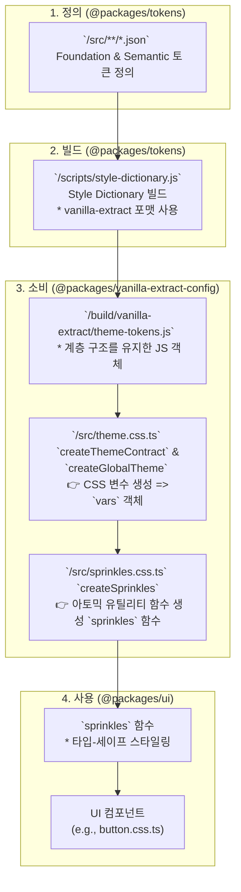

# 디자인 토큰 시스템 (Design Token System)

## 1. 소개 (Introduction)

본 문서는 프로젝트의 일관된 UI를 구축하기 위한 디자인 토큰 시스템을 기술합니다. 디자인 토큰은 색상, 타이포그래피, 간격 등 UI를 구성하는 가장 작은 단위의 시각적 요소를 변수화한 것입니다.

이 시스템은 **Foundation 토큰**과 **Semantic 토큰**의 2-Tier 구조를 가집니다.

- **Foundation Tokens**: 색상 팔레트, 글꼴 크기 등 구체적인 값을 가지는 원시(primitive) 토큰입니다.
- **Semantic Tokens**: '주요 버튼 배경색', '오류 텍스트 색상'과 같이 사용되는 맥락과 의미에 따라 이름을 붙인 토큰입니다. Semantic 토큰은 Foundation 토큰을 참조하여 값을 결정합니다.

## 2. 토큰 네이밍 컨벤션 (Token Naming Convention)

토큰 네이밍은 `category-property-variant-state` 구조를 따릅니다.

- **카테고리 (Category)**: `color`, `typography`, `spacing` 등 토큰의 가장 큰 분류입니다.
- **속성 (Property)**: `text`, `background`, `heading` 등 카테고리 내에서의 구체적인 역할입니다.
- **종류 (Variant)**: `brand`, `default`, `sm` 등 속성의 세부 종류입니다.
- **상태/수식어 (State/Modifier)**: `subtle`, `bold`, `disabled`, `inverse` 등 UI의 상호작용 상태나 변형을 나타냅니다.

| 구분 (Segment)     | 설명                   | 예시 값                                                                                              | 비고                   |
| :----------------- | :--------------------- | :--------------------------------------------------------------------------------------------------- | :--------------------- |
| **Category**       | 토큰의 최상위 카테고리 | `color`, `font`, `spacing`, `sizing`, `shape`, `shadow`, `system`, `layout`, `viewport`              | 항상 소문자            |
| **Property**       | 카테고리 내에서의 역할 | `text`, `background`, `border`, `link`, `overlay`, `family`, `size`, `weight`, `line-height`         | 역할을 직관적으로 표현 |
| **Variant**        | 역할의 구체적 변형     | `default`, `brand`, `neutral`, `info`, `success`, `warning`, `danger`, `sm`, `md`, `lg`, `xl`, `2xl` | scale 값 포함          |
| **State/Modifier** | UI 상태나 변형         | `subtle`, `bold`, `inverse`, `hovered`, `pressed`, `focused`, `disabled`, `selected`, `visited`      | 선택적(Optional)       |

**예시:**

- `color-text-default`: 기본 텍스트의 색상
- `color-background-brand-bold`: 브랜드 색상 배경의 bold 상태
- `typography-heading-xxl`: XXL 제목의 타이포그래피 스타일

## 3. Foundation 토큰

Foundation 토큰은 디자인 시스템의 기본 구성 요소입니다.

### 3.1. Breakpoints

반응형 디자인을 위한 화면 분기점입니다.

| Token Name | Value    |
| :--------- | :------- |
| `xs`       | `480px`  |
| `sm`       | `768px`  |
| `md`       | `1024px` |
| `lg`       | `1280px` |
| `xl`       | `1536px` |
| `2xl`      | `1920px` |

### 3.2. Colors

기본 색상 팔레트입니다. `[color]-[shade]` 형식으로 구성됩니다.

- **Brand**: `brand-100` ~ `brand-900`
- **Neutrals**: `neutral-50` ~ `neutral-950`
- **System Colors**: `blue`, `green`, `purple`, `teal`, `orange`, `bluegrey`, `amber`, `yellow`, `lightgreen`, `indigo`, `pink`, `deeppurple`, `red` (각 `100` ~ `900` shade)
- **Black/White**: `black-25`, `black-50`, `black-75`, `black-100` / `white-25`, `white-50`, `white-75`, `white-100`

### 3.3. Shadow

UI 요소의 입체감을 표현하는 그림자 스타일입니다.

| Token Name | Offset (x/y) | Blur | Spread | Opacity | 사용 맥락                  |
| ---------- | ------------ | ---- | ------ | ------- | -------------------------- |
| elevation1 | 0/2px        | 4px  | 0      | 8%      | 카드, 작은 표면            |
| elevation2 | 0/4px        | 8px  | 0      | 10%     | hover된 카드, 드롭다운     |
| elevation3 | 0/8px        | 16px | 0      | 10%     | 중간 레이어                |
| elevation4 | 0/10px       | 20px | 0      | 10%     | 모달, 다이얼로그           |
| elevation5 | 0/16px       | 32px | 0      | 10%     | 강조된 액션 레이어         |
| elevation6 | 0/12px       | 24px | 0      | 10%     | 시스템 알림, 최상위 레이어 |

### 3.4. Shape

UI 요소의 형태를 결정하는 `radius`와 `width`입니다.

**Radius**

| Token Name | Value    |
| :--------- | :------- |
| `none`     | `0px`    |
| `xs`       | `2px`    |
| `sm`       | `4px`    |
| `md`       | `8px`    |
| `lg`       | `12px`   |
| `xl`       | `16px`   |
| `pill`     | `9999px` |
| `full`     | `100%`   |

**Width**

| Token Name | Value |
| :--------- | :---- |
| `none`     | `0px` |
| `xs`       | `1px` |
| `sm`       | `2px` |
| `md`       | `4px` |
| `lg`       | `8px` |

### 3.5. Sizing

UI 요소의 너비, 높이를 위한 크기 단위입니다. 4px 기반의 숫자 스케일을 사용합니다. (`1` = `4px`)

| Token Name | Value           |
| :--------- | :-------------- |
| `0` - `64` | `0px` - `256px` |
| `auto`     | `auto`          |
| `full`     | `100%`          |
| `min`      | `min-content`   |
| `max`      | `max-content`   |
| `fit`      | `fit-content`   |

### 3.6. Spacing

UI 요소 간의 여백(margin, padding)을 위한 간격 단위입니다. 2px, 4px 기반의 숫자 스케일을 사용합니다. (`1` = `4px`)

| Token Name | Value           |
| :--------- | :-------------- |
| `0` - `64` | `0px` - `256px` |
| `px`       | `1px`           |

### 3.7. Font

텍스트 스타일을 구성하는 기본 요소입니다.

| Property        | Example Key Path                 | Flatten 결과                     |
| :-------------- | :------------------------------- | :------------------------------- |
| Family          | `font.family.heading`            | `font-family-heading`            |
| Size            | `font.size.2xl`                  | `font-size-2xl`                  |
| Weight          | `font.weight.semibold`           | `font-weight-semibold`           |
| Line Height     | `font.line-height.relaxed`       | `font-line-height-relaxed`       |
| Letter Spacing  | `font.letter-spacing.wide`       | `font-letter-spacing-wide`       |
| Text Indent     | `font.text-indent.md`            | `font-text-indent-md`            |
| Text Decoration | `font.text-decoration.underline` | `font-text-decoration-underline` |
| Text Transform  | `font.text-transform.uppercase`  | `font-text-transform-uppercase`  |

### 3.8. System

System 토큰은 레이아웃과 레이어링을 제어하는 기초 값입니다.
UI 컴포넌트가 어떻게 배치되고, 어떤 우선순위를 가지는지 정의합니다.

**Flexbox**
Flexbox 관련 토큰은 align, justify, direction 속성을 정의합니다.

| Token Name                   | Value         |
| :--------------------------- | :------------ |
| system-flex-align-start      | flex-start    |
| system-flex-align-center     | center        |
| system-flex-align-end        | flex-end      |
| system-flex-justify-start    | flex-start    |
| system-flex-justify-center   | center        |
| system-flex-justify-between  | space-between |
| system-flex-justify-around   | space-around  |
| system-flex-direction-row    | row           |
| system-flex-direction-column | column        |

**Grid**

Grid 관련 토큰은 컬럼 수와 간격 시스템의 기반이 됩니다.

| Token Name          | Value |
| :------------------ | :---- |
| system-grid-columns | 12    |

**Z-Index**

레이어의 우선순위를 정의합니다. UI 요소가 겹칠 때 어떤 요소가 위에 올지 결정합니다.

| Token Name              | Value       | Description      |
| :---------------------- | :---------- | :--------------- |
| system-z-index-base     | 0 기본 레벨 |
| system-z-index-dropdown | 1000        | 드롭다운 메뉴    |
| system-z-index-sticky   | 1100        | sticky 헤더/요소 |
| system-z-index-overlay  | 1200        | 오버레이         |
| system-z-index-modal    | 1300        | 모달 다이얼로그  |
| system-z-index-popover  | 1400        | 팝오버           |
| system-z-index-tooltip  | 1500        | 툴팁             |

**Opacity**

컴포넌트의 투명도를 정의합니다. 상태 전환 시 점진적 표현을 위해 사용됩니다.

| Token Name         | Value |
| :----------------- | :---- |
| system-opacity-0   | 0     |
| system-opacity-25  | 0.25  |
| system-opacity-50  | 0.5   |
| system-opacity-75  | 0.75  |
| system-opacity-100 | 1     |

## 4. Semantic 토큰

Semantic 토큰은 Foundation 토큰에 의미를 부여하여 실제 UI에 적용됩니다.

### 4.1. Color

색상은 `text`, `background`, `border`, `link`, `overlay` 카테고리로 나뉩니다. 각 카테고리는 상태(e.g., `hovered`, `disabled`)와 종류(e.g., `brand`, `danger`)에 따라 세분화됩니다.

**예시:**

| Semantic Token Name           | Referenced Foundation Token | Description                  |
| :---------------------------- | :-------------------------- | :--------------------------- |
| `color-text-default`          | `{color.neutral.900}`       | 기본 텍스트 색상             |
| `color-text-danger`           | `{color.red.700}`           | 위험 상태 텍스트 색상        |
| `color-background-brand-bold` | `{color.brand.700}`         | 브랜드 배경 색상 (Bold)      |
| `color-border-focused`        | `{color.blue.500}`          | 포커스 상태의 테두리 색상    |
| `color-overlay-25`            | `{color.black.25}`          | 25% 투명도의 검은색 오버레이 |

### 4.2. Elevation

입체감(그림자, 배경색)을 표현하는 시맨틱 토큰입니다.

| Semantic Token Name         | Description                              |
| :-------------------------- | :--------------------------------------- |
| `elevation-surface`         | 기본 표면 색상                           |
| `elevation-surface-hovered` | Hover 시 표면 색상                       |
| `elevation-shadow-raised`   | 떠있는 듯한 그림자 효과                  |
| `elevation-shadow-overlay`  | 오버레이(모달 등)에 사용되는 그림자 효과 |

### 4.3. Typography

타이포그래피는 `heading`, `text`, `display`, `caption`, `overline`, `code` 등 역할에 따라 **여러 Foundation 토큰(Font Family, Size, Weight, Line Height 등)**을 참조하여 정의된 복합 스타일입니다.

- 구조: `typography-[role]-[scale]-[variant?]`
- 역할(Role): `heading`, `text`, `display`, `caption`, `overline`, `code`

| Semantic Token Name          | Description                               |
| :--------------------------- | :---------------------------------------- |
| `typography-text-md-regular` | 중간 크기(md)의 일반(regular) 본문 텍스트 |
| `typography-heading-xxl`     | XXL 제목 스타일                           |
| `typography-display-lg`      | 큰 크기(lg)의 디스플레이 텍스트           |
| `typography-caption-sm`      | 작은 크기(sm)의 캡션 텍스트               |
| `typography-code-inline`     | 인라인 코드 스타일                        |

- 토큰 Object 구조 예시

```
"typography": {
  "heading": {
    "xxl": {
      "value": {
        "fontFamily": "{font.family.heading}",
        "size": "{font.size.4xl}",
        "fontWeight": "{font.weight.bold}",
        "lineHeight": "{font.line-height.tight}",
        "letterSpacing": "{font.letter-spacing.tight}",
        "textDecoration": "{font.text-decoration.none}",
        "textCase": "{font.text-case.none}",
        "paragraphIndent": "{font.paragraph-indent.none}"
      },
      "type": "typography"
    }
  }
}
```

### 4.4. Layout

레이아웃 관련 토큰은 `container`, `grid`, `flex`, `section`, `content` 등으로 구성됩니다.

**Container**

- 반응형 컨테이너의 최대 너비를 정의합니다.
- `layout-container-[scale]` 네이밍 규칙을 따르며, 각 scale은 breakpoints와 매핑됩니다.

  | Semantic Token Name    | Referenced Foundation Token | Description            |
  | :--------------------- | :-------------------------- | :--------------------- |
  | `layout-container-xs`  | `{breakpoints.xs}`          | XS 컨테이너 최대 너비  |
  | `layout-container-sm`  | `{breakpoints.sm}`          | SM 컨테이너 최대 너비  |
  | `layout-container-md`  | `{breakpoints.md}`          | MD 컨테이너 최대 너비  |
  | `layout-container-lg`  | `{breakpoints.lg}`          | LG 컨테이너 최대 너비  |
  | `layout-container-xl`  | `{breakpoints.xl}`          | XL 컨테이너 최대 너비  |
  | `layout-container-2xl` | `{breakpoints.2xl}`         | 2XL 컨테이너 최대 너비 |

**Grid**

- Grid 레이아웃의 `gutter`, `gap` 단위를 정의합니다.
- `system.grid` 토큰(align, justify, direction)과 함께 사용됩니다.
- **gutter**: 컬럼 간의 간격
- **gap**: row 간의 간격

  | Semantic Token Name  | Referenced Foundation Token | Description             |
  | :------------------- | :-------------------------- | :---------------------- |
  | `layout-grid-gutter` | `{spacing.6}`               | 그리드 컬럼 사이의 간격 |
  | `layout-grid-gap-sm` | `{spacing.4}`               | 작은 간격의 grid gap    |
  | `layout-grid-gap-md` | `{spacing.6}`               | 중간 간격의 grid gap    |
  | `layout-grid-gap-lg` | `{spacing.8}`               | 큰 간격의 grid gap      |

**Flex**

- Flexbox 레이아웃의 `gap` 단위를 정의합니다.
- `system.flex` 토큰(align, justify, direction)과 함께 사용됩니다.

  | Semantic Token Name  | Referenced Foundation Token | Description |
  | :------------------- | :-------------------------- | :---------- |
  | `layout-flex-gap-sm` | `{spacing.2}`               | 작은 gap    |
  | `layout-flex-gap-md` | `{spacing.4}`               | 중간 gap    |
  | `layout-flex-gap-lg` | `{spacing.6}`               | 큰 gap      |

**Section**

- 페이지 섹션 단위의 padding 및 margin 스케일입니다.

  | Semantic Token Name         | Referenced Foundation Token | Description  |
  | :-------------------------- | :-------------------------- | :----------- |
  | `layout-section-padding-sm` | `{spacing.6}`               | 작은 padding |
  | `layout-section-padding-md` | `{spacing.10}`              | 중간 padding |
  | `layout-section-padding-lg` | `{spacing.16}`              | 큰 padding   |
  | `layout-section-margin-sm`  | `{spacing.6}`               | 작은 margin  |
  | `layout-section-margin-md`  | `{spacing.10}`              | 중간 margin  |
  | `layout-section-margin-lg`  | `{spacing.16}`              | 큰 margin    |

**Content**

- 본문 영역 및 부가 영역 크기를 정의합니다.

  | Semantic Token Name            | Referenced Foundation Token | Description         |
  | :----------------------------- | :-------------------------- | :------------------ |
  | `layout-content-maxWidth-sm`   | `640px`                     | 본문 최대 너비 (sm) |
  | `layout-content-maxWidth-md`   | `768px`                     | 본문 최대 너비 (md) |
  | `layout-content-maxWidth-lg`   | `1024px`                    | 본문 최대 너비 (lg) |
  | `layout-content-maxWidth-xl`   | `1280px`                    | 본문 최대 너비 (xl) |
  | `layout-content-sidebar-width` | `{sizing.64}`               | 사이드바 너비       |

### 4.5. Viewport

`breakpoints`를 참조하여 반응형 디자인을 위한 뷰포트 크기를 정의합니다.

| Semantic Token Name | Referenced Foundation Token | Description       |
| ------------------- | --------------------------- | ----------------- |
| viewport-xs         | {breakpoints.xs}            | XS 사이즈 뷰포트  |
| viewport-sm         | {breakpoints.sm}            | SM 사이즈 뷰포트  |
| viewport-md         | {breakpoints.md}            | MD 사이즈 뷰포트  |
| viewport-lg         | {breakpoints.lg}            | LG 사이즈 뷰포트  |
| viewport-xl         | {breakpoints.xl}            | XL 사이즈 뷰포트  |
| viewport-2xl        | {breakpoints.2xl}           | 2XL 사이즈 뷰포트 |

## 5. 토큰-UI 파이프라인: Style-Dictionary와 Vanilla-Extract

이 섹션은 `packages/tokens`에 정의된 JSON 토큰이 `packages/vanilla-extract-config`를 거쳐 `packages/ui` 컴포넌트에서 사용되기까지의 전체 데이터 흐름과 아키텍처를 설명합니다.

### 5.1. 전체 흐름도 (Flow Diagram)



### 5.2. 단계별 상세 설명

#### 1단계: 토큰 정의 (JSON)

- **위치**: `packages/tokens/src/**/*.json`
- **설명**: 모든 디자인 토큰(Foundation, Semantic)은 사람이 읽고 관리하기 쉬운 계층형 JSON 파일로 정의됩니다.

```json
// packages/tokens/src/semantic/colors.json 예시
{
  "color": {
    "background": {
      "brand": { "value": "{color.brand.500}", "type": "color" }
    }
  }
}
```

#### 2단계: 빌드 (Style Dictionary)

- **위치**: `packages/tokens/scripts/style-dictionary.js`
- **설명**: Style Dictionary는 JSON 파일들을 읽어, 설정된 포맷에 따라 다양한 결과물로 변환합니다. 우리 시스템의 핵심은 `javascript/vanilla-extract` 포맷입니다. 이 포맷은 토큰의 계층 구조를 그대로 유지한 JavaScript 객체(`themeTokens`)를 생성합니다.

```javascript
// 빌드 결과물: packages/tokens/build/vanilla-extract/theme-tokens.js
export const themeTokens = {
  color: {
    background: {
      brand: "#3355ff",
    },
  },
};
```

#### 3단계: 테마 및 Sprinkles 생성 (Vanilla Extract)

**a) 테마 계약 및 전역 스타일 생성**

- **위치**: `packages/vanilla-extract-config/src/theme.css.ts`
- **설명**: 빌드된 `themeTokens` 객체를 사용하여 다음 두 가지 작업을 수행합니다.
  1.  `createThemeContract`: `themeTokens`의 구조를 기반으로 타입-세이프한 **CSS 변수 계약 객체(`vars`)**를 생성합니다. 이 객체는 실제 값이 아닌 CSS 변수 이름(e.g., `var(--color-background-brand-asdf)`)을 가집니다.
  2.  `createGlobalTheme`: `:root`에 실제 CSS 변수와 값을 주입합니다.

```typescript
// packages/vanilla-extract-config/src/theme.css.ts
import { createGlobalTheme, createThemeContract } from "@vanilla-extract/css";
import { themeTokens } from "@packages/tokens/vanilla-extract";

// themeTokens 구조와 동일한 CSS 변수 계약 객체 생성
export const vars = createThemeContract(themeTokens);

// :root에 실제 CSS 변수 주입
createGlobalTheme(":root", vars, themeTokens);
```

**b) Sprinkles (아토믹 유틸리티) 생성**

- **위치**: `packages/vanilla-extract-config/src/sprinkles.css.ts`
- **설명**: Sprinkles는 **Vanilla Extract의 `createSprinkles`**를 활용하여,  
  토큰 기반으로 **타입-세이프한 유틸리티 스타일 API**를 제공합니다.  
  본 프로젝트에서는 `responsive`, `state`, `unconditional` 3가지 그룹으로 나누어 관리합니다.

```typescript
// packages/vanilla-extract-config/src/sprinkles.css.ts
import { defineProperties, createSprinkles } from "@vanilla-extract/sprinkles";
import { vars } from "./theme.css";

const colorProperties = defineProperties({
  // ...,
  properties: {
    backgroundColor: vars.color.background, // background 속성에 color.background 토큰 그룹을 매핑
    color: vars.color.text,
  },
  shorthands: {
    background: ["backgroundColor"], // 'background' 축약 속성 정의
    text: ["color"],
  },
});

export const sprinkles = createSprinkles(colorProperties, ...);
```

**a) Responsive Properties**

반응형 속성을 지원합니다. breakpoints(`xs` ~ `2xl`)를 기반으로 `@media` 조건이 자동 생성됩니다.  
주요 속성:

- `display`, `flexDirection`, `justifyContent`, `alignItems`
- spacing(`padding*`, `margin*`)
- `gap`
- sizing(`width`, `height`, `min/max`)

**사용 예시:**

```tsx
<div
  className={sprinkles({
    display: { xs: "block", md: "flex" },
    paddingX: { xs: "sm", lg: "lg" },
    gap: { md: "4" },
  })}
/>
```

**b) State Properties**

상태 조건(`hover`, `focus`, `active`, `disabled`)을 지원합니다.
Semantic 토큰(`vars.color`, `vars.shadow`, `vars.system.opacity`)과 매핑됩니다.

**사용 예시:**

```tsx
<button
  className={sprinkles({
    backgroundColor: { default: "brand.500", hover: "brand.600" },
    color: { default: "text.default", disabled: "text.disabled" },
    boxShadow: { hover: "elevation3" },
  })}
/>
```

**c) Unconditional Properties**

상태/반응형과 관계없이 항상 적용되는 속성입니다.
타이포그래피, border, cursor, transition 등의 속성을 포함합니다.

주요 속성:

- `borderWidth`, `borderRadius`, `borderStyle`
- `fontWeight`, `fontSize`, `lineHeight`
- `textAlign`
- `cursor`
- `transition`

**사용 예시:**

```tsx
<p
  className={sprinkles({
    fontSize: "md",
    fontWeight: "semibold",
    textAlign: "center",
    borderRadius: "md",
  })}
/>
```

**d) Shorthands**

DX 향상을 위해 여러 속성을 한 번에 지정할 수 있는 축약 속성을 제공합니다.
| Shorthand | 확장되는 속성들 |
| ---------- | ---------------------------------------------------- |
| `padding` | paddingTop, paddingBottom, paddingLeft, paddingRight |
| `paddingX` | paddingLeft, paddingRight |
| `paddingY` | paddingTop, paddingBottom |
| `margin` | marginTop, marginBottom, marginLeft, marginRight |
| `marginX` | marginLeft, marginRight |
| `marginY` | marginTop, marginBottom |
| `size` | width, height |

**e) 타입 안정성**

`Sprinkles` 타입과 `ResponsiveValue` 유틸리티를 export하여, consumer 코드에서 props를 안전하게 전달할 수 있습니다. 이를 통해 자동완성과 타입 검증을 모두 지원합니다.

```typescript
// sprinkles.css.ts
export type Sprinkles = Parameters<typeof sprinkles>[0];
export type ResponsiveValue<Value extends string | number> = ConditionalValue<
  typeof responsiveProperties,
  Value
>;
```

**사용 예시**

```tsx
import {
  sprinkles,
  type Sprinkles,
  type ResponsiveValue,
} from "@packages/vanilla-extract-config";

type ButtonProps = {
  size?: ResponsiveValue<"sm" | "md" | "lg">;
};

function Button({ size = "md" }: ButtonProps) {
  return (
    <button
      className={sprinkles({
        padding: { xs: "sm", md: size },
        borderRadius: "md",
      })}
    >
      버튼
    </button>
  );
}
```

**f) 확장 가이드**

- 새로운 속성을 추가하려면 `defineProperties`의 `properties` 항목에 토큰을 매핑하면 됩니다.
- 모든 추가 속성은 자동으로 `sprinkles` 함수와 타입 시스템에 반영됩니다.

#### 4단계: 컴포넌트에서 사용

- **위치**: `packages/ui/src/components/button.css.ts`
- **설명**: UI 컴포넌트의 스타일을 정의할 때, `sprinkles` 함수를 사용하여 의미론적이고 타입-세이프하게 스타일을 적용합니다. 조건부 스타일링을 통해 `:hover` 상태 등도 간결하게 처리할 수 있습니다.

```typescript
// packages/ui/src/components/button.css.ts
import { sprinkles } from "@packages/vanilla-extract-config";

export const buttonColorVariants = {
  primary: sprinkles({
    background: {
      default: "brand", // 기본 상태의 배경색
      hover: "brand.bold", // hover 상태의 배경색
    },
    text: "default.inverse", // 텍스트 색상
  }),
  // ... other variants
};
```

이러한 파이프라인을 통해 개발자는 토큰의 실제 값(`"#3355ff"`)이 아닌, 의미가 담긴 이름(`'brand'`)을 사용하여 UI를 개발할 수 있으며, 전체 시스템의 일관성과 유지보수성을 크게 향상시킬 수 있습니다.
